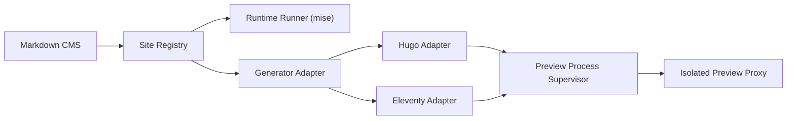
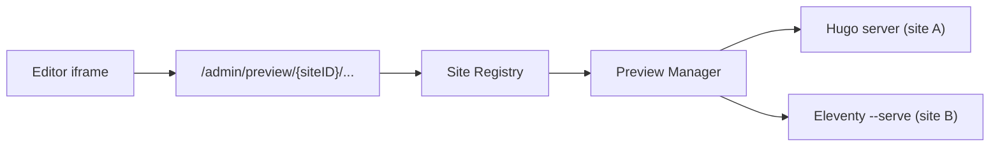

# マルチサイト・マルチジェネレーター設計

最終更新日: 2026-07-10

## ステータス

段階実装中。現在のHugo向け動作を維持しながら、Site Registry、site-aware API、site別preview processへ移行している。

## 背景

現在の実装は、単一の`REPO_PATH`、Hugoの`content`と`static`、単一のHugoプレビュープロセスを前提としている。この構造のままHugoのバージョン違いやEleventyを追加すると、ジェネレーター固有の条件分岐が記事、メディア、プレビュー、プロセス管理へ広がる。

目標は「HugoとEleventyを個別に組み込んだCMS」ではなく、「Markdownコンテンツを管理し、サイトジェネレーターをアダプターとして利用するCMS」とすることである。

## 目標

- 複数のサイトリポジトリを同時に管理できる。
- サイトごとに異なるHugoバージョンを利用できる。
- Hugo以外のMarkdownベースのジェネレーターを追加できる。
- 記事編集、Front Matter、Git操作をジェネレーターから分離する。
- プレビュー用プロセスをサイトごとに安全に管理する。
- 既存の`static/admin/config.yml`を後方互換として利用できる。

## 非目標

- すべての静的サイトジェネレーターを自動判定して無設定で動かすこと。
- EleventyのData Cascadeや任意JavaScriptを構造化フォームで完全に編集すること。
- 未登録または信頼されていないリポジトリのコードをCMSサーバー上で直接実行すること。

## 基本方針

### CMSとサイトのランタイムを分離する

CMSルートの`mise.toml`ではCMS自身のGoバージョンだけを管理する。HugoとNode.jsは各サイトの要件であり、CMS全体へ単一バージョンを固定しない。

```toml
# hugo-cms/mise.toml
[tools]
go = "1.24.11"
```

Hugoサイトの例:

```toml
# managed-site/mise.toml
[tools]
hugo = "<site-specific-version>"
```

Eleventyサイトの例:

```toml
# managed-site/mise.toml
[tools]
node = "<site-specific-version>"
```

Eleventy本体とプラグインは`package.json`およびlockファイルで固定する。CMSは次のように対象リポジトリのmise環境を使ってコマンドを実行する。

```text
mise exec -C <repository> -- <generator-command>
```

miseはディレクトリごとの設定階層と、別ディレクトリを指定したコマンド実行をサポートしている。

- <https://mise.jdx.dev/configuration.html>
- <https://mise.jdx.dev/cli/exec.html>

### 信頼済み設定とリポジトリ設定を分離する

実行可能なコマンドやリポジトリの登録情報は、Gitで取得したサイト設定をそのまま信用せず、CMS管理者が管理する。

| 設定 | 管理場所 | 主な内容 |
|---|---|---|
| サイト登録設定 | CMSサーバー側 | ID、リポジトリ、generator種別、認証、実行ポリシー |
| コンテンツ設定 | 各サイトリポジトリ | コレクション、Front Matter、メディア、URL規則 |
| ランタイム設定 | 各サイトまたはサーバー管理 | Hugo、Node.jsのバージョン |

サーバー側の登録例:

```yaml
sites:
  - id: techblog
    repo_path: D:/sites/techblog
    generator: hugo
    runtime: mise

  - id: notes
    repo_path: D:/sites/notes
    generator: eleventy
    runtime: mise
    package_manager: npm
```

サイトリポジトリ側には、ジェネレーターに依存しない`.homecms.yml`を置く。

```yaml
version: 1

content:
  collections:
    - name: posts
      folder: content/posts
      extension: md
      frontmatter: yaml

media:
  folder: assets/images
  public_path: /images

preview:
  url_field: permalink
```

既存サイトでは`static/admin/config.yml`を読み込み、新形式へ段階的に移行できるようにする。

## コンポーネント構成



### Site Registry

単一の`REPO_PATH`を置き換え、サイトごとに次の情報を保持する。

- サイトID
- リポジトリの実パス
- generator種別
- ランタイム方式
- Gitリモートとブランチ
- プレビュー状態
- 認可ポリシー

APIにはサイトIDを含める。URL例は`/admin/sites/{siteID}/api/articles`とする。

### Generator Adapter

ジェネレーター固有処理は小さなインターフェースへ閉じ込める。

```go
type GeneratorAdapter interface {
	Validate(ctx context.Context, site Site) error
	PreviewCommand(site Site, port int) CommandSpec
	BuildCommand(site Site) CommandSpec
	ResolvePreviewURL(article Article) (string, error)
}
```

アダプターはコマンドの定義だけを返し、プロセスを直接管理しない。起動、停止、タイムアウト、ログ収集は共通の`ProcessSupervisor`が担当する。

### Runtime Runner

コマンドを対象サイトのランタイムで実行する。

- mise設定の読み込み
- 必要ツールの存在確認
- 作業ディレクトリの固定
- 環境変数の最小化
- タイムアウト
- 標準出力と標準エラーの収集

未登録の任意コマンドをリポジトリ設定から直接実行してはならない。標準アダプターで対応できないサイト向けのカスタムコマンドは、管理者の明示承認と隔離環境を必須とする。

### Preview Process Supervisor

単一グローバルなHugoプロセスではなく、サイトIDをキーにしたプロセス管理を行う。

- サイト単位の起動・停止・再起動
- 多重起動防止
- shutdown時の全preview停止
- `/admin/preview/{siteID}/...` 経由の認証付きproxy
- selected siteのiframe preview

現在の実装では、ポートはSite Registryの`hugo_server_port`で明示する。今後の改善候補として、動的な空きポート割り当て、readiness確認、アイドル時の自動停止、同時起動数やCPU/メモリ制限がある。



preview proxyはCMSの認証済みadmin route配下に置く。直接`127.0.0.1:<preview-port>`をブラウザへ露出しないことで、previewプロセスのbind先をローカルに閉じ込めやすくする。

### Site Runtime Bridge

既存サービスの多くは`config.RepoPath`などのprocess-wide runtime値を参照している。現在は互換性を保つため、HTTP handler層で選択サイトを解決し、短時間だけruntime値を適用するbridgeを使っている。

- site-scoped APIは`?site=`または`X-CMS-Site`で対象サイトを指定する。
- preview process管理はサイト設定を明示的に受け取り、site IDごとにadapterを保持する。
- 記事キャッシュは`repo_path + content_dir`でkey分割する。
- process-wide runtimeを読むscope外処理はruntime lockで保護する。

今後の最終形は、記事・メディア・Git・generatorサービスへ`SiteConfig`または`SiteRuntime`を明示的に渡し、process-wide runtime mutationを削減することである。

## ジェネレーターごとの差異

| 項目 | Hugo | Eleventy |
|---|---|---|
| ランタイム | Hugoバイナリ | Node.jsとnpmパッケージ |
| 標準コンテンツ | `content` | サイト設定による |
| 標準出力 | `public` | `_site` |
| メディア | `static`、Page Bundle等 | Passthrough Copy等 |
| プレビュー | `hugo server` | `eleventy --serve` |
| Front Matter | YAML、TOML、JSON | YAML、JSON、JavaScript等 |
| URL決定 | slug、permalink、Page Kind等 | permalink、Data Cascade等 |

### Hugo Adapter

標準的なプレビューコマンド:

```text
mise exec -C <repository> -- hugo server \
  --bind 127.0.0.1 \
  --port <allocated-port> \
  --buildDrafts \
  --buildFuture
```

Hugoは`--source`、`--bind`、`--port`などを公式に提供している。

- <https://gohugo.io/commands/hugo_server/>

Hugoの`module.hugoVersion`は最低・最大バージョンの互換性確認に利用できるが、実際に使用する完全なバージョンはサイト側のmiseで固定する。

- <https://gohugo.io/configuration/module/#hugo-version>

Hugo Extendedの要件確認は新しいHugoでは非推奨化されているため、Extendedフラグだけをランタイム選択の根拠にしない。

### Eleventy Adapter

Eleventyはサイトの`package.json`にローカル依存関係として追加し、lockファイルをコミットする。

```json
{
  "scripts": {
    "cms:preview": "eleventy --serve",
    "cms:build": "eleventy"
  },
  "devDependencies": {
    "@11ty/eleventy": "<site-specific-version>"
  }
}
```

標準的なプレビューコマンド:

```text
mise exec -C <repository> -- npm run cms:preview -- --port=<allocated-port>
```

Eleventyは入力・出力ディレクトリをサイト設定で変更でき、`--serve`と`--port`を提供している。

- <https://www.11ty.dev/docs/usage/>
- <https://www.11ty.dev/docs/config/>

依存関係の取得はHTTPリクエスト処理中に行わない。サイト登録時または管理者が承認した更新処理で`npm ci`を実行し、成功した環境だけをプレビューへ使用する。

## コンテンツ管理の共通化

### 記事探索

`repo/content`の全Markdownを走査する現在の実装を、コレクション設定に記載されたフォルダの探索へ変更する。除外パターンとシンボリックリンクの扱いもコレクション単位で定義する。

### Front Matter

共通のcodecとして次を扱う。

- YAML
- TOML
- JSON
- Front Matterを持たないMarkdown

EleventyはYAML、JSON、JavaScript Front Matterを標準で扱う。

- <https://www.11ty.dev/docs/data-frontmatter/>

JavaScript Front Matterは任意コードを含み、構造化データへ安全かつ可逆に変換できない。初期対応ではraw編集のみとし、フォーム編集や自動正規化の対象外とする。

また、EleventyのData Cascadeでは記事ファイル外のデータが最終値へ影響する。初期対応では記事自身のFront Matterだけを編集対象とし、「ビルド時の実効値」と同一とは限らないことをUIに表示する。

### メディア

Hugoの`static`とPage Bundleを前提にせず、コレクションごとの保存先と公開パスを利用する。

Eleventyの静的ファイル配置は`addPassthroughCopy`などサイト設定によって変わる。

- <https://www.11ty.dev/docs/copy/>

CMSはEleventy設定JavaScriptを解析して保存先を推測せず、`.homecms.yml`で明示されたメディア設定を使用する。

### プレビューURL

MarkdownのファイルパスからURLを文字列置換する現在の方式は廃止する。HugoのpermalinkやEleventyのData Cascadeを考慮し、次の順序で決定する。

1. コレクション設定の明示的なURLテンプレート
2. Front Matterの`url`または`permalink`
3. Generator Adapterによる解決
4. 解決不能時はサイトルートを表示

## ジェネレーター判定

自動判定は初期設定を補助する用途に限定し、保存された明示設定を優先する。

Hugo候補:

- `hugo.toml`
- `hugo.yaml`
- `hugo.json`
- `config/_default`

Eleventy候補:

- `package.json`に`@11ty/eleventy`が存在する
- `eleventy.config.js`
- `eleventy.config.mjs`
- `.eleventy.js`

両方が検出された場合や独自構成の場合は、自動選択せず管理者に選択を求める。

## セキュリティ境界

Eleventyの設定はJavaScriptであり、npm依存関係のインストール時にもスクリプトが実行され得る。マルチジェネレーター対応では、リポジトリを単なるMarkdownデータではなく実行コードとして扱う。

最低限、次を必要とする。

- 管理者が登録したリポジトリだけを実行する。
- CMSのGitHub OAuthトークン、`SESSION_SECRET`、CSRF関連情報を子プロセスへ渡さない。
- プロセスまたはコンテナをサイト単位で分離する。
- 読み書きを対象リポジトリと専用キャッシュへ制限する。
- 不要なネットワークアクセスを制限する。
- CPU、メモリ、プロセス数、実行時間を制限する。
- プレビューを管理画面とは別オリジンで配信する。
- mise設定のhookや任意タスクを無条件にtrustしない。

信頼できる自社リポジトリだけを対象とする初期版でも、子プロセスへCMSの秘密情報を継承させないことと、プレビューのオリジン分離は先に実施する。

## 移行計画

### Phase 1: 現行Hugo処理の抽象化（実装済み）

- `GeneratorAdapter`を導入する。
- 現在のHugo起動・ビルド処理を`HugoAdapter`へ移す。
- 動作とAPIは変更しない。

`pkg/services/generator.go`に共通インターフェースと互換ラッパーを置き、`pkg/services/hugo_adapter.go`へHugo固有処理を分離した。プレビューのプロセス状態は`ProcessManager`が終了を待ってから更新する。

### Phase 2: マルチサイト対応（一部実装）

- `Site Registry`を追加する。
- APIへサイトIDを導入する。
- プレビューをサイト単位のプロセス管理へ変更する。
- サイトごとのmise環境でHugoを起動する。

`SITES_CONFIG_PATH`からSite Registryを読み込み、default siteの`repo_path`、`generator`、`content_dir`、`static_dir`、`public_dir`を既存APIへ適用できるようにした。`GET /admin/api/sites`で読み込み結果を確認できる。

未実装:

- UI上のサイト切替
- `/admin/sites/{siteID}/api/...`形式のsiteId付きAPI
- サイト単位のプレビューProcessManager
- サイトごとのmise実行

### Phase 3: コンテンツとメディアの共通化

- `content`、`static`、`public`のハードコードを除去する。
- `.homecms.yml`を導入する。
- Front Matter codecを分離する。
- プレビューURL解決をアダプター化する。

`CONTENT_DIR`、`STATIC_DIR`、`PUBLIC_DIR`を追加し、記事、メディア、Hugo build/newの主要パスを設定値へ寄せた。`.homecms.yml`とプレビューURL解決の完全なアダプター化は未実装。

### Phase 4: 実行環境の隔離

- 子プロセスの環境変数を最小化する。
- リソース制限とタイムアウトを追加する。
- プレビューを別オリジンに分離する。
- 依存関係の準備処理を管理者操作として追加する。

Hugo/Eleventyの子プロセスへ渡す環境変数をallowlist方式にし、`SESSION_SECRET`やGitHub OAuth secretなどCMS側の秘密情報を継承しないようにした。リソース制限、別オリジン配信、依存関係準備フローは未実装。

### Phase 5: Eleventy対応

- Node.jsとlockファイルの検証を追加する。
- `EleventyAdapter`を実装する。
- YAML/JSON Front MatterとMarkdown本文を対応する。
- JavaScript Front Matterはraw編集に限定する。

初期版の`EleventyAdapter`を追加した。`package.json`とlockファイルを必須とし、lockfileに対応するpackage managerでローカル依存のEleventyを起動・ビルドする。新規記事はCMS configのcollectionに一致する場合だけFront Matter codec経由で生成する。

未実装:

- UIからのgenerator差分表示
- siteId単位のEleventyプレビュー
- JavaScript Front Matterのraw編集表示
- Eleventy Data Cascadeの実効値表示

## 未決事項

- Site Registryをファイル、データベース、どちらで管理するか。
- リポジトリをCMS配下へ置くか、専用ワークスペースへ分離するか。
- サイト設定のスキーマとバージョニング方法。
- プレビュー用サブドメインまたはオリジンの割り当て方法。
- Eleventy以外のジェネレーターへカスタムコマンドを許可する範囲。
- Node.js依存関係キャッシュの共有単位。
